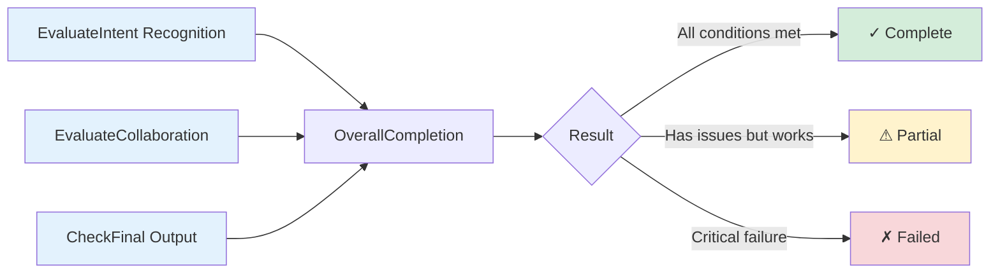

# Smart Home Multi-Agent Benchmark
This benchmark evaluates LLM-based multi-agent smart home systems. It contains 60 test cases across three complexity levels.


## Guide

Here is the roadmap for this documentation:

1.  **[Benchmark Structure and Test Case Format](#1-benchmark-structure-and-test-case-format)** - Overview of complexity levels and definitions of the JSON data fields.
2.  **[How to Use This Benchmark](#2-how-to-use-this-benchmark)** - Execution and evaluation steps.
3.  **[Intent Specification](#3-intent-specification)** - Logic for "Required" and "Acceptable" intents.
4.  **[Device Types](#4-device-types)** - The 8 device interfaces your system needs to map to.
5.  **[Evaluation Criteria](#5-evaluation-criteria)** - Assessment standards.
---


## 1. Benchmark Structure and Test Case Format

- **Simple cases** (1-2 intents): 20 cases
- **Moderate cases** (3 intents): 20 cases
- **Complex cases** (4+ intents): 20 cases

Each test case in `benchmark_data.json` contains the following fields:

- **`id`**: Unique identifier (e.g., "simple_01", "moderate_15")
- **`category`**: Complexity level ("simple", "moderate", or "complex")
- **`user_input`**: Natural language user request
- **`required_intents` or `acceptable_intents`**: Expected intents
- **`collaboration`**: Collaboration requirements between devices
- **`expected_final_output`**: Expected end result
---
## 2. How to Use This Benchmark

### 1. Load the Test Cases

```python
import json

with open('benchmark_data.json', 'r') as f:
    benchmark = json.load(f)

for test_case in benchmark['test_cases']:
    user_input = test_case['user_input']
    # Run your system
```

### 2. Map Your Devices

Map your system's devices to the benchmark's [device types](#4-device-types). For example:
- Your "Alexa" → `search` type
- Your "LG Smart Fridge" → `fridge` type
- Your "Samsung TV" → `display` type

### 3. Running the Benchmark
Execute the following script to run the system and generate interaction logs.

Note: This script does not calculate the final score automatically. Please refer to the "Manual Evaluation" section below for scoring instructions.

From the `system-implementation/` directory:

```bash
# Run all 60 test cases
python run_benchmark.py all

# Run by category
python run_benchmark.py simple
python run_benchmark.py moderate  
python run_benchmark.py complex
```

### 4. Manual Evaluation Process
Once the simulation is complete (Step 3), proceed with the performance evaluation:

1. Review the logs generated in **[Step 3: Running the Benchmark](#3-running-the-benchmark)**
2. Verify Execution: check if the activated devices and actions match the `required_intents`/`acceptable_intents` in `benchmark_data.json` 
3. Verify Collaboration: check if collaboration occurred correctly
4. Record the results: Complete / Partial / Failed based on the **[Evaluation Criteria](#5-evaluation-criteria)**

Success rate can be calculated as: (Complete cases / Total cases) × 100%


## 3. Intent Specification

### 1. `required_intents` (Common)

Used for **explicit, unambiguous user requests** where the system should identify specific intents.

**Format:**
```json
{
  "required_intents": [
    {"intent": "Set 20-minute timer", "device_type": "clock"},
    {"intent": "Dim lights", "device_type": "light"}
  ]
}
```

**Evaluation:**
- **Correct**: System identifies **all** listed intents.
- **Partial**: System identifies **some but not all** listed intents.
- **Incorrect**: System identifies **none** of the listed intents (or identifies wrong ones).

---

### 2. `acceptable_intents` (For Ambiguous Cases)

Used for **implicit or ambiguous user requests** where multiple interpretations are reasonable. The system should identify **at least one** of the listed intents.

**Format:**
```json
{
  "acceptable_intents": [
    {"intent": "Lower temperature", "device_type": "thermostat"},
    {"intent": "Find lunch recipe", "device_type": "search"}
  ]
}
```

**Evaluation:**
Any combination of listed intents is acceptable
- **Correct**: System identifies **at least one** of the listed intents.
- **Partial**: Not applicable (this category is binary; identifying any valid intent is sufficient).
- **Incorrect**: System identifies **none** of the listed intents.


**Acceptable system behaviors:**
- Identifies thermostat only ✓
- Identifies search only ✓
- Identifies both ✓
- Identifies neither ✗

---

### 3. Mixed: `required_intents` + `acceptable_intents` 

Used when a user request contains both **explicit intents** and **ambiguous intents**.
**Format:**
```json
{
  "required_intents": [
    {"intent": "Set wake-up alarm", "device_type": "clock"}
  ],
  "acceptable_intents": [
    {"intent": "Play gentle music", "device_type": "audio"},
    {"intent": "Dim lights", "device_type": "light"},
    {"intent": "Adjust temperature", "device_type": "thermostat"}
  ],
  "note": "Clock required. At least one sleep environment device expected for 'Correct'. Only clock → 'Partial'."
}
```

**Evaluation:**
- **Correct**: All `required_intents` satisfied **AND** at least one `acceptable_intents` identified.
- **Partial**:
  - All `required_intents` satisfied **BUT** no `acceptable_intents` identified.
  - OR `required_intents` are only **partially** satisfied (regardless of acceptable intents).
- **Incorrect**: No `required_intents` satisfied.
---
## 4. Device Types

This benchmark uses the following device type abstractions. Systems should map their devices to these types:

### search
- **Description**: Web search and information retrieval
- **Capabilities**: Search for recipes, locations, recommendations; provide music recommendations; general information lookup
- **Examples**: search engine, web browser, voice assistant with search

### fridge
- **Description**: Food inventory
- **Capabilities**: Check available ingredients, track food inventory
- **Examples**: smart fridge, food inventory tracker

### display
- **Description**: Visual output and content display
- **Capabilities**: Show videos/TV shows/movies, display recipes/schedules/information
- **Examples**: TV, monitor, screen, smart display

### audio
- **Description**: Audio playback and sound control
- **Capabilities**: Play music/podcasts/audio content, adjust volume
- **Examples**: smart speaker, sound system, stereo, voice assistant with audio

### clock
- **Description**: Time related and timer functions
- **Capabilities**: Set timers and alarms, time tracking
- **Examples**: timer, alarm clock, smart clock

### thermostat
- **Description**: Temperature control and climate management
- **Capabilities**: Adjust temperature, climate control
- **Examples**: smart thermostat, climate control system

### light
- **Description**: Lighting control and adjustment
- **Capabilities**: Turn lights on/off, adjust brightness, set lighting scenes
- **Examples**: smart bulb, light switch, dimmer, lighting system

### calendar
- **Description**: Schedule and event management
- **Capabilities**: Add/view calendar events, schedule management, appointment tracking
- **Examples**: calendar app, scheduling system, digital planner

---

## 5. Evaluation Criteria

Each test case is evaluated along three dimensions, which together determine the overall completion rating:



### Intent Recognition & Device Activation

Evaluates whether the system correctly identifies user intents and activates appropriate devices. Check which devices were activated and what actions they performed.

**Correct:** All of the following conditions must be met:
- All `required_intents` addressed (corresponding devices activated and performed actions)
- At least one `acceptable_intents` addressed (if specified in test case)
- Appropriate devices selected based on intent requirements

**Partial:** Any of the following conditions results in a partial rating:
- Some `required_intents` missed (corresponding devices not activated)
- OR all `acceptable_intents` missed (when specified)
- OR devices activated but performed suboptimal actions

**Incorrect:** Any of the following conditions results in an incorrect rating:
- All `required_intents` missed (no corresponding devices activated)
- OR completely wrong devices activated (e.g., thermostat activated when clock was required)
- OR devices activated but performed meaningless actions

### Collaboration Success


For test cases requiring coordination among multiple devices (`collaboration.is_needed = true`), evaluates whether agents correctly identify collaboration needs and execute collaboration effectively. Each collaboration instance is evaluated individually.

**Successful:** A single collaboration is rated as successful when all of the following conditions are met:

- Agent correctly identifies the need for external information
- Obtains appropriate information from the correct source (via explicit request or shared state access)
- Collaboration response properly integrated

**Failed:** A single collaboration is rated as failed when any of the following occurs:
- Agent fails to recognize the need for collaboration
- Requests information from the wrong agent
- Requests wrong or irrelevant information
- Fails to integrate collaboration response properly

### Overall Completion

Assesses system performance in fulfilling user requests.

**Complete:**
A test case is rated as *Complete* when **all** of the following conditions are met:
- Intent recognition & device activation rated as "Correct"
- All required collaborations rated as "Successful"
- System produces coherent and complete final output

**Partial:**
A test case is rated as *Partial* when the system has quality issues but still produces output:
- Intent recognition & device activation is rated as "Partial" OR some collaborations failed
- Despite these issues, the system produces output (though with omissions or minor errors)

**Failed:**
A test case is rated as *Failed* when **any** of the following occurs:
- Intent recognition & device activation rated as "Incorrect"
- Collaborations failed such that the primary user intent cannot be fulfilled
- System unable to produce meaningful output
